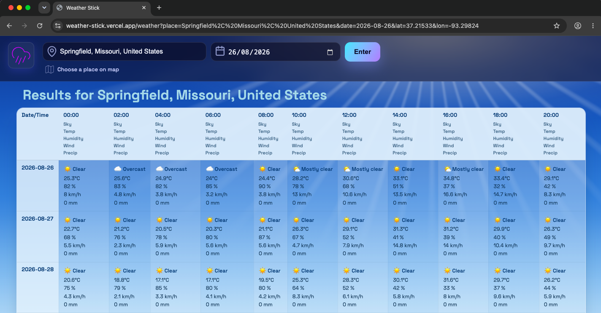
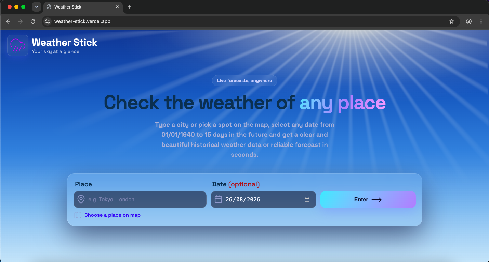
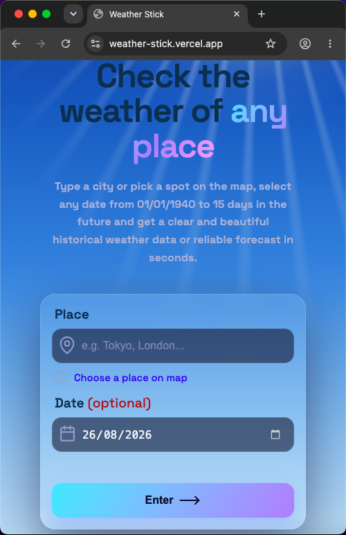
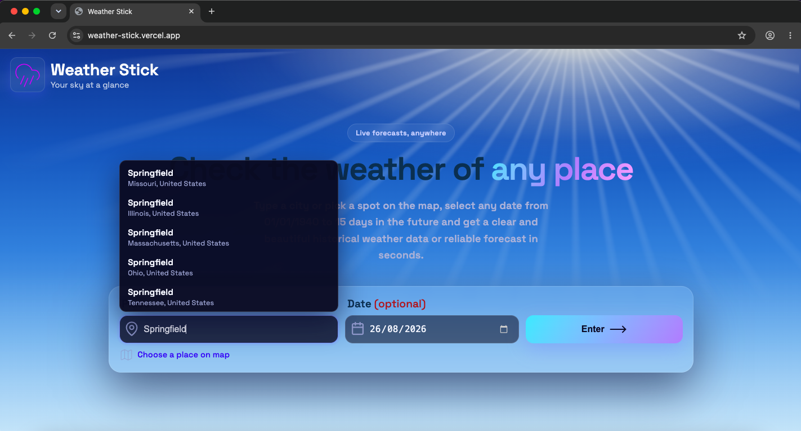
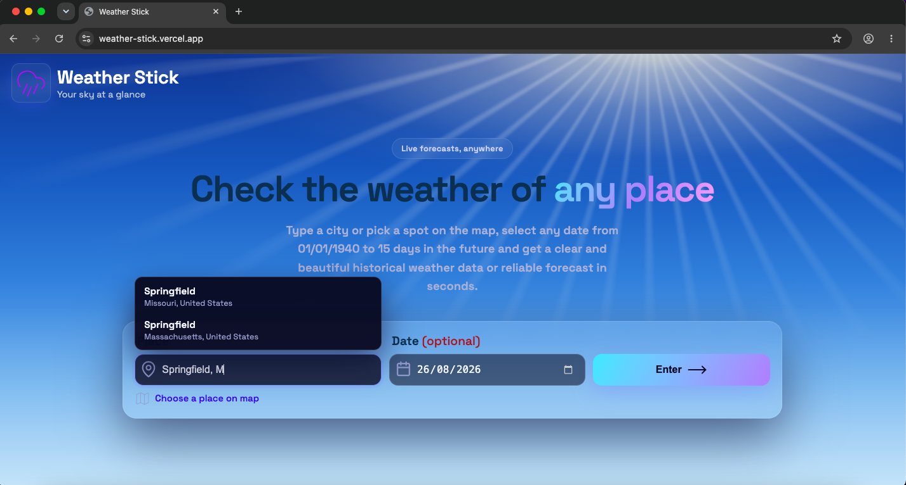
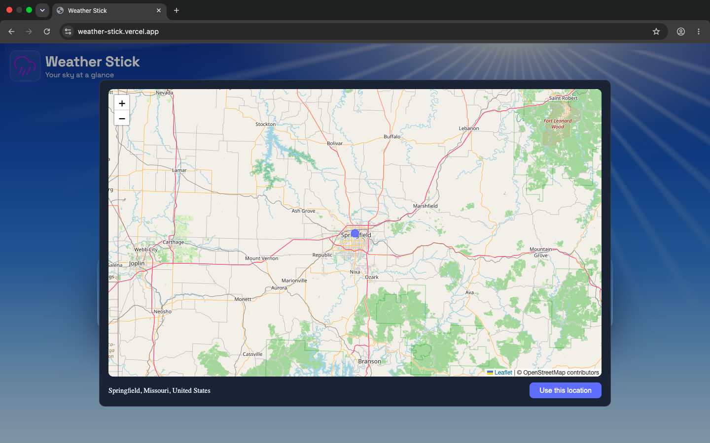

# Interactive Geo-Spatial Weather Analytics Dashboard (Weather Stick)

### 🔗 Live Link [https://weather-stick.vercel.app](https://weather-stick.vercel.app)



_The hour-by-hour matrix — days × time-slots, each cell led by its sky condition (icon + label) and stacking temperature, humidity, wind and precipitation._

<table>
  <tr>
    <td></td>
    <td></td>
  </tr>
</table>

_One responsive layout, desktop to mobile._





_Type a city, then refine by region or country to pin the exact place._



_Prefer pointing? Click anywhere on the map and it resolves the spot to a real place._

---

**Your Sky at a Glance.** Weather Stick turns a place and a date into a clean, scrollable hour-by-hour weather matrix — pulling from **80+ years of historical records (since 1940)** or **live forecasts up to 15 days ahead**, and deciding which source to use automatically.

> This is a front-end engineering showcase built around a deceptively simple idea. It shows the weather but the interesting part is **how** it does it — the endpoint routing, the race handling, and the disambiguation under the hood — and where it's headed (see the [Roadmap](#roadmap)).

---

## What it does today

- **Place + date search** — pick a location and any date; the app resolves it to real coordinates and fetches the weather.
- **Autocomplete with disambiguation** — a debounced dropdown of up to five real matches (name · region · country). Selecting one carries its exact coordinates forward, so the result is never a wrong-guess lookalike — "Springfield, Illinois" is not "Springfield, Missouri", and the app knows the difference.
- **Pick on a map** — rather than type, click anywhere on a map and the app reverse-geocodes the point to a real place name, then carries the exact coordinates forward — same guarantee as autocomplete, no keyboard needed.
- **Sky conditions at a glance** — every cell leads with the sky as an icon + label (Clear ☀️, Overcast, Light rain 🌦️, Thunderstorm ⛈️…), so the grid reads without parsing numbers.
- **Hour-by-hour matrix** — a scrollable table of days × time-slots (every 2nd hour), each cell stacking temperature, humidity, wind and precipitation. The top bar stays put while the grid scrolls.
- **History _and_ forecast, automatically** — one search silently routes to the right data source depending on how far back the date sits.
- **A hand-built sky** — the background is a pure-CSS blue-sky Tyndall effect with god-rays. No images, no libraries.
- **Responsive** — one layout that reflows cleanly from wide desktop down to a phone.

## Under the hood

The parts a reviewer might not expect in a "weather app":

- **Dual-endpoint routing.** Open-Meteo splits history (ERA5 archive, 1940 → recent) and forecast (past ~3 months → 15 days ahead) across two APIs. The app picks the correct endpoint from the anchor date, and builds a rolling 8-day window that truncates cleanly at the forecast ceiling instead of erroring.
- **Latest-wins async everywhere.** Both the weather fetch and the autocomplete use an `AbortController` + an `active` guard, so a slow earlier request can never overwrite a newer one — no flicker, no stale results.
- **Debounced, cancellable search.** Suggestions fire 300 ms after typing pauses, are aborted on the next keystroke, and search only the pre-comma token so "Tokyo, Japan" still matches on "Tokyo" — then narrow locally by the region/country you type after the comma.
- **Disambiguation carried through the URL.** A picked place travels as `lat`/`lon` params, so the results page uses the exact spot and skips a redundant geocode — while free-typed names and shared links still fall back to geocoding.
- **Browser-only map, no SSR crash.** Leaflet touches `window` at import, which would break Next's server render — so it's dynamically imported inside an effect (client only), with the container built/torn down across the React commit cycle and animations disabled to kill a teardown-time race on close.
- **Forced per-request rendering on the results page.** The results route reads its `searchParams`, so Next renders it dynamically per request instead of serving one build-time static shell — without that, a repeated navigation reused the cached first render and every later search showed the first result.
- **Layered architecture.** `types` → `services` (plain async) → `util` (pure logic) → `hooks` (orchestration) → `components` (UI). Endpoint URLs are injected into the pure logic, not hardcoded inside it.
- **Type-level safety.** The table's metric keys are _derived_ from the cell type, so an invalid metric is a compile error, not a runtime `undefined`.
- **Zustand.** Form state persists across reloads via the `persist` middleware backed by `sessionStorage`.

## Roadmap

Weather Stick is built to grow.

- [x] **Core** — place + date → historical/forecast weather matrix
- [x] **Autocomplete** — debounced geocoding dropdown with disambiguation
- [x] **Choose a place on the map** — pick a spot visually instead of typing
- [x] **Conditions + icons** — sky condition (clear / rain / snow / storm…) with matching icons per cell, so the grid reads at a glance
- [ ] **History section** — a two-level view for exploring past weather

> The goal isn't "another weather app." It's a small, correct, well-structured app that keeps earning its complexity one feature at a time.

## Project structure

The codebase is organised in one direction — UI depends on orchestration, which depends on pure logic and async services, which depend on shared types. Nothing lower reaches back up.

```
weather-stick/
├── public/                         # Static assets served as-is (SVG icons)
├── src/
│   ├── app/                        # Next.js App Router entry points
│   │   ├── layout.tsx
│   │   ├── page.tsx                # homepage route
│   │   └── weather/page.tsx        # results route
│   ├── components/                 # Code for UI
│   ├── css/                        # CSS Modules
│   ├── hooks/                      # orchestration — state + effects
│   ├── services/                   # async data access (fetch only)
│   ├── stores/                     # Zustand store (persisted form state)
│   ├── types/                      # Shared TypeScript types
│   └── util/                       # pure logic — no I/O, easy to test
├── .prettierrc
├── .gitignore
└── README.md
```

## Tech stack

- **Next.js** (App Router) + **React 19**
- **TypeScript**
- **Zustand** for form state (persisted to `sessionStorage`)
- **CSS Modules** — all styling hand-written, including the pure-CSS background
- **[Leaflet](https://leafletjs.com/)** + **[OpenStreetMap](https://www.openstreetmap.org/)** tiles / **Nominatim** reverse geocoding — for the click-to-pick map
- **[Open-Meteo](https://open-meteo.com/)** — geocoding, ERA5 archive, and forecast APIs (no API key required)

## Run locally

```bash
npm install
npm run dev
```

Then open [http://localhost:3000](http://localhost:3000).

No environment variables or API keys are needed — Open-Meteo's endpoints are open.

## Data sources

Weather and place data come from [Open-Meteo](https://open-meteo.com/), free for non-commercial use:

- **Geocoding** — place name → coordinates, region, country
- **Archive (ERA5)** — historical hourly data from 1940
- **Forecast** — recent past through 15 days ahead

The map picker is powered by [OpenStreetMap](https://www.openstreetmap.org/), rendered with [Leaflet](https://leafletjs.com/):

- **Tiles** — OpenStreetMap map imagery, drawn by Leaflet
- **Reverse geocoding (Nominatim)** — map click coordinates → real place name

Please respect each provider's usage policy — [Open-Meteo](https://open-meteo.com/en/terms), [OpenStreetMap](https://www.openstreetmap.org/copyright), and the [Nominatim usage policy](https://operations.osmfoundation.org/policies/nominatim/).
